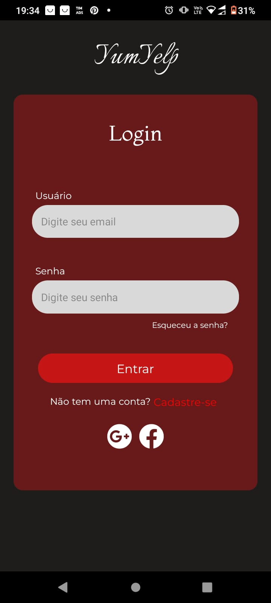
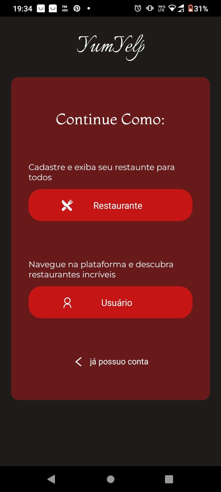
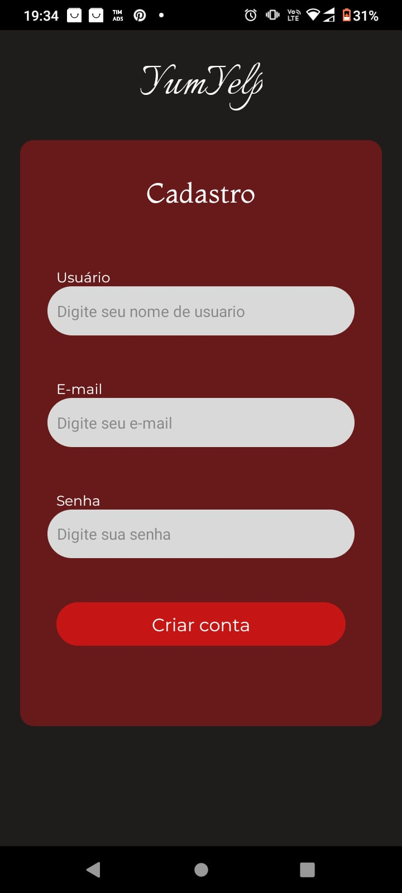
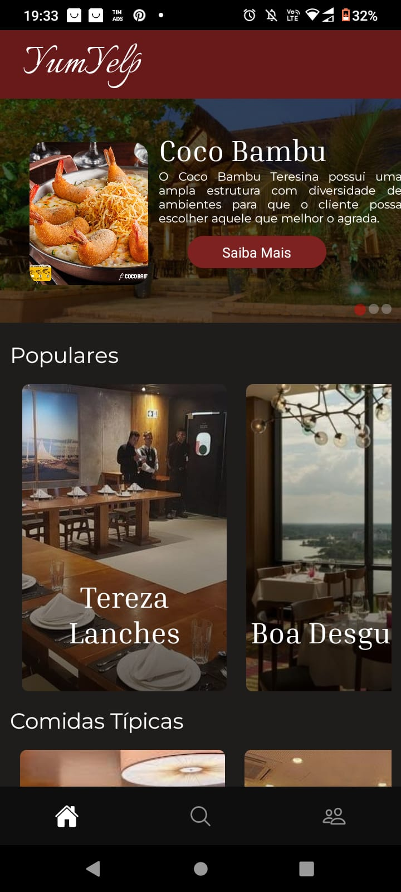
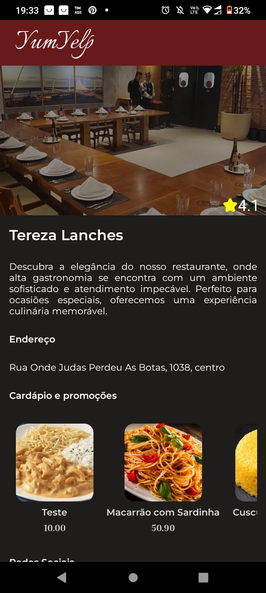
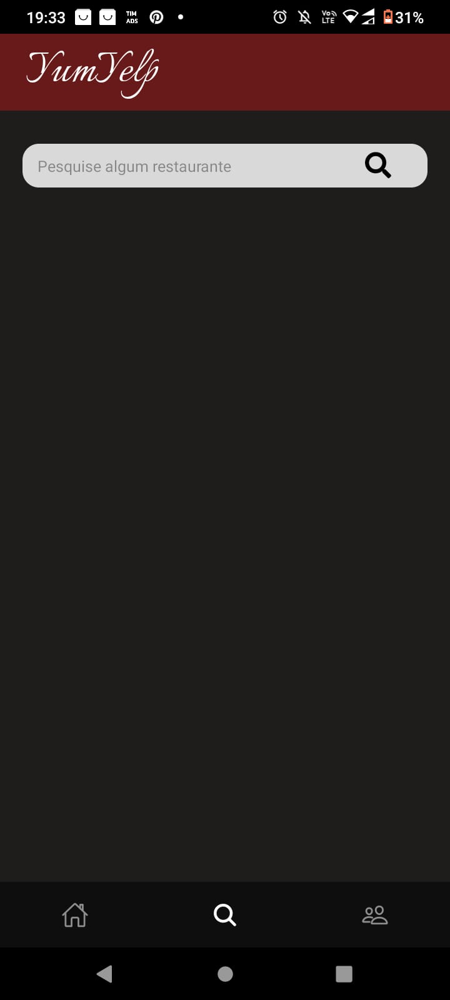
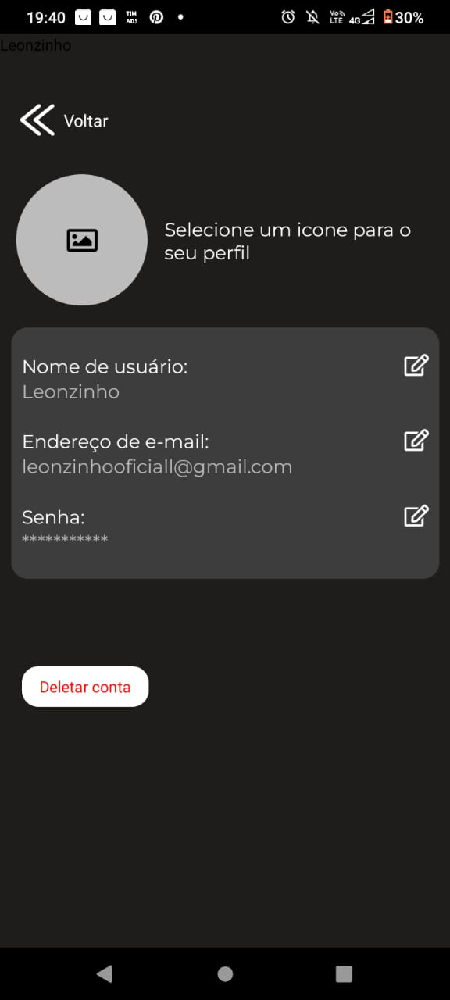
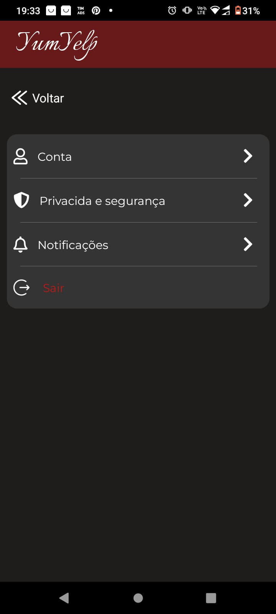
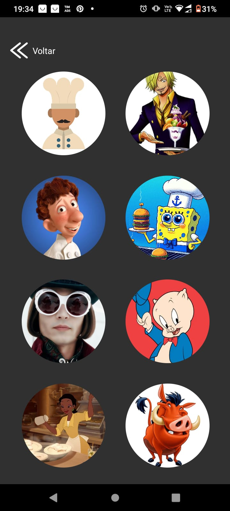

# YumYelp

O YumYelp é um aplicativo mobile focado no cadastro e recomendação de restaurantes, projetado para ajudar os usuários a descobrir os melhores lugares para comer. Seu principal objetivo é fornecer recomendações personalizadas e confiáveis, tornando a experiência de encontrar o restaurante ideal rápida e agradável.

## Exibição do Projeto

  

     
     
           
  

  

     
     
     
  

  

  

  

     
     
     
  

## Tecnologias

- React Native
- React Navigation
- Expo
  
## Equipe

